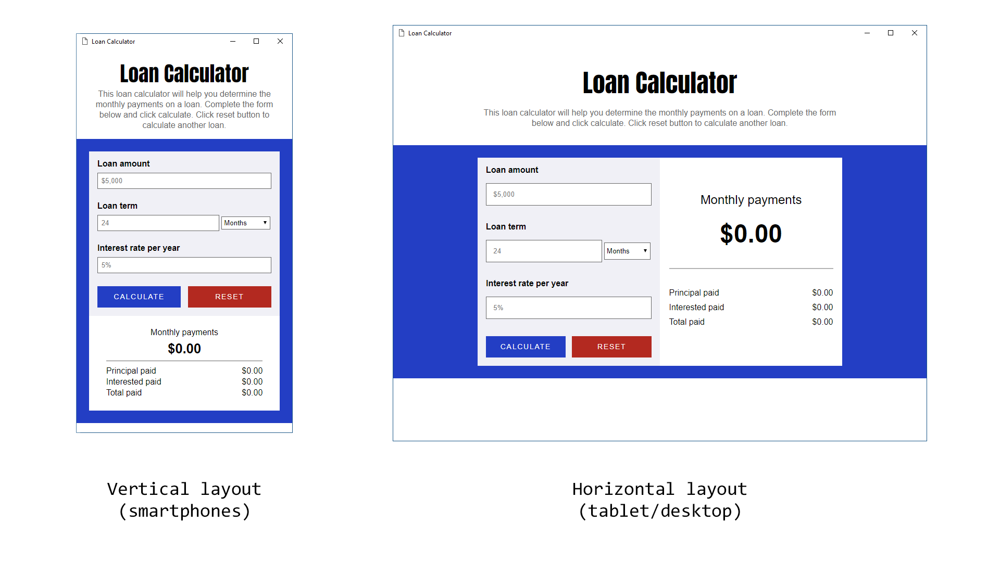

# Loan Calculator
This simple app allows you to determine the monthly payments on a loan, given a certain amount, interest and term. It's based on many other loan calculator available on the web.

## How it works
Enter the loan amount, the interest rate (monthly) and the term (in months or years), then click calculate to know the monthly payments. If you typed an invalid value for an input, the system will tell you what's wrong. You can click reset button to calculate another loan. The layout is responsive: it's vertical for mobile devices, while it's horizontal for desktop and landscape screen.

## Technologies
The app was made with HTML5, CSS3 and JavaScript. The main goal was to practice some pure (Vanilla) JavaScript, so I didn't use any library such as jQuery. The responsiveness of the layout is made with media queries, and it's based on window's width.

## Images

